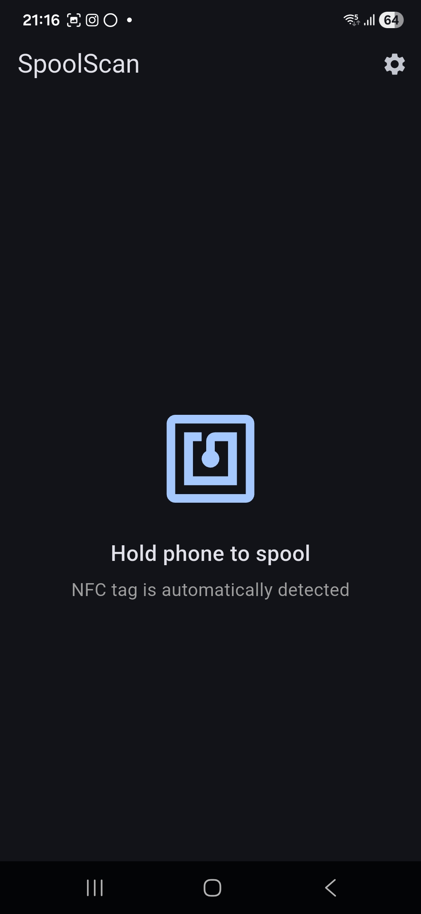
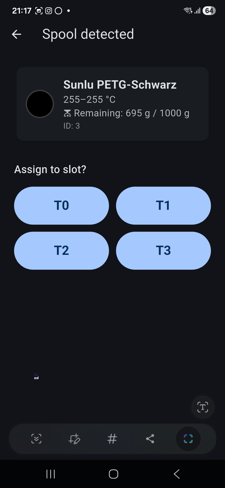
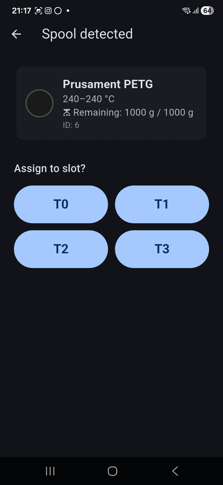
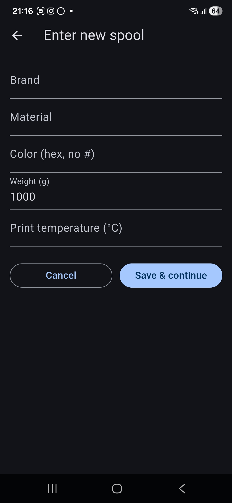

# SpoolScan 📡

> Free offline NFC spool scanner for the Snapmaker U1 — auto-registers spools in Spoolman, tracks usage via Moonraker.

[](https://github.com/CASAI77/spoolscan/releases/latest)
[](https://github.com/CASAI77/spoolscan/releases/latest)
[](https://github.com/CASAI77/spoolscan/releases/latest)
[](https://github.com/CASAI77/spoolscan/releases/latest)
[](LICENSE)

**SpoolScan** is a free **Android NFC scanner for filament spools** on the **Snapmaker U1**. Tap a spool with your phone, the app looks it up (or registers it) in [Spoolman](https://github.com/Donkie/Spoolman) and assigns it to a print slot via Moonraker. Reads **OpenPrintTag**, **OpenSpool** and **SpoolCompanion** tags. No subscription, no account, no cloud.

**Available in English and German.**

## Screenshots

| Scan | Known spool | OpenPrintTag spool | Manual entry |
|---|---|---|---|
|  |  |  |  |
| Tap a tag to scan | Live remaining weight from Spoolman | OpenPrintTag auto-registered | Manual entry for blank tags |

---

## Features

- **Reads three NFC tag formats:**
  SpoolCompanion (`SPOOL:3`), OpenSpool (JSON), and OpenPrintTag (Prusa's new
  open standard, [openprinttag.org](https://openprinttag.org/))
- **Three-stage spool lookup:**
  Spoolman ID → NFC hardware UID → unknown (then auto-create)
- **Self-healing UID linking:**
  After the first scan, the chip's NFC UID is stored in Spoolman
  (`extra.nfc_uid`). Future scans of the same physical tag are matched instantly,
  regardless of tag format.
- **Automatic spool registration:**
  Unknown spools are created in Spoolman on the spot — vendor, filament and
  spool entries are added automatically when needed.
- **Hybrid create flow:**
  - OpenPrintTag/OpenSpool with data → confirmation dialog with prefilled values
  - SpoolCompanion / blank NTAG → manual entry form prefilled with what was on
    the tag
- **Consumption tracking** via Moonraker's `[spoolman]` integration — the app
  sets the active spool, Moonraker reports usage, the DetailScreen shows the
  current remaining weight on every scan.
- **Spoolman stays unmodified** — uses only the official REST endpoints plus
  the standard `extra` field schema. Update Spoolman freely without breaking
  the app.
- **Language toggle:** Deutsch / English
- **Works fully offline for tag reading** — only needs your local network for
  Spoolman/Moonraker calls.

## Requirements

- Android phone with NFC
- Snapmaker U1 with Moonraker running
- [Spoolman](https://github.com/Donkie/Spoolman) reachable on your local network
- NFC tags on your spools (any of the three supported formats — or even blank
  NTAGs, which the app will register on first scan)

### Snapmaker U1 firmware (important!)

To make the spool / RFID workflow work end-to-end on the printer side, three
things are required on the Snapmaker U1:

1. **Snapmaker official firmware ≥ v1.2.0** — OpenRFID support was introduced
   in the official v1.2.0 firmware. Older versions don't expose the RFID
   subsystem the rest of this stack relies on.
2. **[paxx12 SnapmakerU1-Extended-Firmware](https://github.com/paxx12/SnapmakerU1-Extended-Firmware)**
   (e.g. release `v1.2.0-paxx12-14` or newer) — extended firmware built on
   top of official v1.2.0 that adds full **OpenRFID** support
   ([details](https://github.com/paxx12/SnapmakerU1-Extended-Firmware/releases)).
   Without this firmware the RFID / multi-tool spool tracking on the printer
   doesn't work, and SpoolScan's slot assignments won't be reflected in
   Spoolman or counted during prints.
3. **[Davo1624 snapmaker-u1 spoolman setup](https://github.com/Davo1624/snapmaker-u1)**
   — Klipper macros that map the four tool slots (T0–T3) to Spoolman channels
   (`SET_CHANNEL_SPOOL`, `t<slot>__spool_id` persistent variables, etc.).
   Required for SpoolScan's per-slot assignment to register as the "Aktive Rolle"
   in Spoolman.

If you don't have these installed yet, install them on the printer first.
SpoolScan itself will still launch without them, but slot assignment, "Aktive
Rolle" updates and consumption tracking will not work.

## Installation

1. Download the latest `app-release.apk` from the [Releases](../../releases) page
2. On your Android phone: Settings → Security → allow installation from unknown
   sources
3. Open the APK file and install

## Setup

Open the app → tap the settings icon (top right):

| Setting | Example |
|---|---|
| Printer IP (Moonraker) | `192.168.1.179` |
| Spoolman URL | `192.168.1.181:7912` |

### Enable consumption tracking (one-time)

For Spoolman to receive filament usage automatically from Moonraker, add this
block to `~/printer_data/config/moonraker.conf` on the Snapmaker U1:

```ini
[spoolman]
server: http://192.168.1.181:7912
sync_rate: 5
```

(Adjust the URL for your environment.) Then restart Moonraker:

```bash
sudo systemctl restart moonraker
```

Once active spool is set via SpoolScan, Moonraker will reduce `remaining_weight`
in Spoolman during prints. The DetailScreen displays the live remaining weight
on every scan.

## Usage

1. Open SpoolScan
2. Hold the phone to a spool's NFC tag
3. **Known spool:** brand, material, color and remaining weight from Spoolman
   are shown immediately
4. **Unknown spool:** confirmation dialog (auto-fill) or entry form opens —
   confirm/save and the spool is registered
5. Tap T0 / T1 / T2 / T3 to assign the spool to that slot

## NFC Tag Formats

**SpoolCompanion:**
```
SPOOL:3
FILAMENT:3
```

**OpenSpool (JSON):**
```json
{"protocol":"openspool","spool_id":3,"brand":"Sunlu","type":"PETG","color_hex":"000000"}
```

**OpenPrintTag (JSON):**
```json
{"standard":"openprinttag","brand":"Prusament","material":"PETG","color_hex":"1a1a1a","weight_total":1000,"weight_remaining":850,"print_temp":240}
```

Spec: <https://openprinttag.org/>

## How it works (short)

```
Scan ─► UID + payload extracted
       │
       ├─► Stage 1: tag carries a Spoolman ID? → fetch /spool/{id}
       ├─► Stage 2: search /spool list for extra.nfc_uid match
       └─► Stage 3: create new spool (auto from tag data, or manual form)

Found ─► Self-heal: store the chip UID on the matched spool if missing
       ─► Show details + remaining weight
       ─► Pick slot → Moonraker SET_ACTIVE_SPOOL
       ─► Print → Moonraker reports usage → Spoolman updates remaining_weight
```

## Tech Stack

- Flutter 3.x (Dart)
- [nfc_manager](https://pub.dev/packages/nfc_manager) — NFC tag reading
- [http](https://pub.dev/packages/http) — Moonraker & Spoolman API
- [shared_preferences](https://pub.dev/packages/shared_preferences) — settings storage
- [mockito](https://pub.dev/packages/mockito) — test mocks
- Moonraker REST API + `[spoolman]` integration
- Spoolman REST API v1

## Build from Source

```bash
git clone https://github.com/YOUR_USERNAME/spoolscan.git
cd spoolscan
flutter pub get
flutter build apk --release
```

## License

This project is licensed under the **GNU General Public License v3.0** —
see [LICENSE](LICENSE) for details.

---

## Support

If you find this project useful, consider buying me a coffee! ☕

[](https://buymeacoffee.com/casai)
